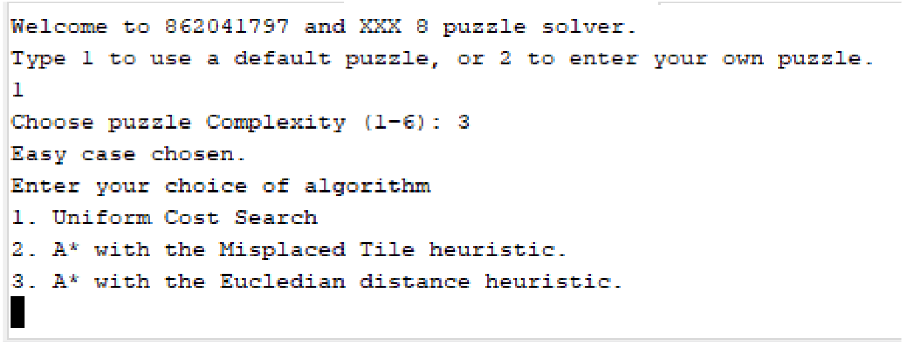

# 8-Puzzle Artificial Intelligence
### Zachary Hill and Khuaja Shams

The following is a guideline of what is expected when implementing the code and the different scenarios to expect for different inputs:

The end/goal puzzle will be given, {{1,2,3}, {4,5,6}, {7,8,0}}, so all we need to decide is the initial puzzle and the search algorithm to implement.

First, run the output frame of mainTree.cpp in the open terminal by typing $output mainTree.cpp.

(1)

You should see a message that asks for the type of puzzle you would like to answer. There are only two options to select, type '1' for default puzzle or '2' to create your own puzzle. This puzzle will be set as the initial puzzle. Note: the variable to continue playing is set to 'Y' by default, will discuss this later in the instructions. 

After you type '1' or '2' and press ENTER the next task will be different but if you did not input '1' or '2' you will see a message that says "That is not a valid choice! Please re-enter your choice: " and you will have to type a new input agaian and again UNTIL you type '1' or '2', there can be spacing before or after but nothing else.

If you typed '1' you should see the following display:

If you typed '2' you should see the following display:

Also, type three numbers ranging from 0-8, make sure to space each. Once the first row is filled press ENTER to go to the next row and type three more numbers, continue this until you have three rows each containing three numbers creating a 3x3 array puzzle. Note: the index containing '0' will represent the blank square. If you type anything symbols other than 0-8, more or less than three numbers per row, and/or use the same number in more than one row you should see the message "Invalid Puzzle! Please enter your puzzle again below!" then you will again see the same message for inputting the numbers as shown above.

(2)

Now that we have the initial puzzle and the goal puzzle the next step to the select the algorithm from the list shown below:

Enter '1' for Uniform Cost Search, '2' for A* Search with Misplaced Tiles, or '3' for A* Search Using Euclidean Distance then press Enter. Again the program will verify your input and ask you to re-enter if it's not.

(3)

After selecting the algorithm, an entire list of nodes from the Tree will be displayed by using Breadth-First Search. The process and end of the simulation should look somewhat like below:

You should also see the maximum number of nodes in the queue as well as the total n umber of nodes expanded for the selected initial puzzle and algorithm.

(4)

Lastly, you will be asked if you want another puzzle solved, you will be asked to enter 'Y' for yes or 'N' for no then press Enter. If neither is inputted you will be asked to enter another response until you type 'Y' or 'N', agian spacing is allowed. If you chose yes, you will return to the line that asks you to choose the initial puzzle; on the other hand, if you chose no, the simulation will end with the message "Thank you for playing!".

Have fun with solving as many 8 puzzles as you like in the given C++ program! (But only puzzle that are 3x3, 8 tiles to slide, no more no less.)

